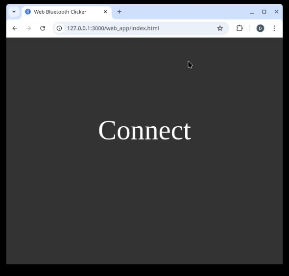

# Web Bluetooth Clicker

A simple Web Bluetooth application combined with OTA-capable firmware that streams temperature notifications on button press. The web app connects to the device, displays the latest temperature reading, and maintains a real-time click count.

## Features

- **Web Bluetooth Connectivity**: Easily connect the web app to a compatible Bluetooth device.
- **Temperature Notifications**: Each button press on the device triggers a notification with the current temperature, which the web app displays in real-time.
- **Click Counter**: The web app tracks the number of button presses and updates the click count alongside the temperature.
- **OTA-Capable Firmware**: The firmware allows for over-the-air updates, making it easy to add improvements.

## Demo

## Getting Started

### Prerequisites

- A Bluetooth-enabled device with the provided firmware installed.
- A compatible web browser with Web Bluetooth API support (e.g., Chrome).

### Installation

1. Clone this repository.
1. Open index.html in a Web Bluetooth-compatible browser.
1. Load the OTA-capable firmware on your Bluetooth device.

### Usage

1. Open the web app in your browser.
1. Click the "Connect" button and select your Bluetooth device.
1. Press the button on the device. Each press will stream the current temperature as a notification, which will be displayed on the web app. The web app also updates the click count independently.
